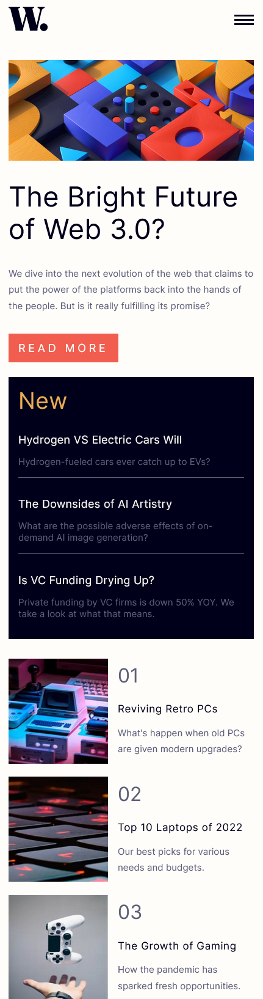
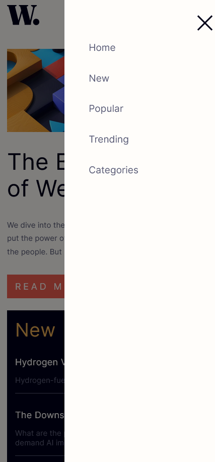
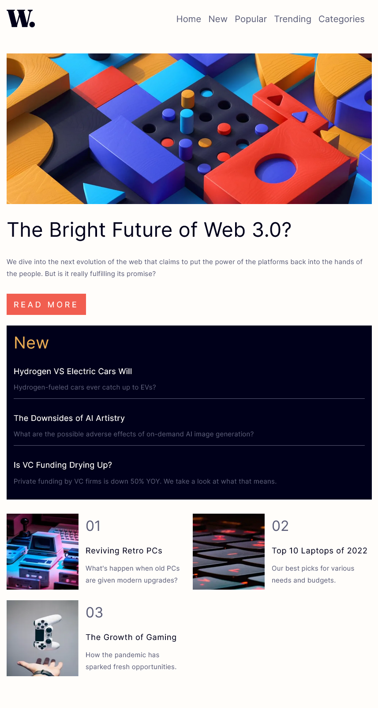
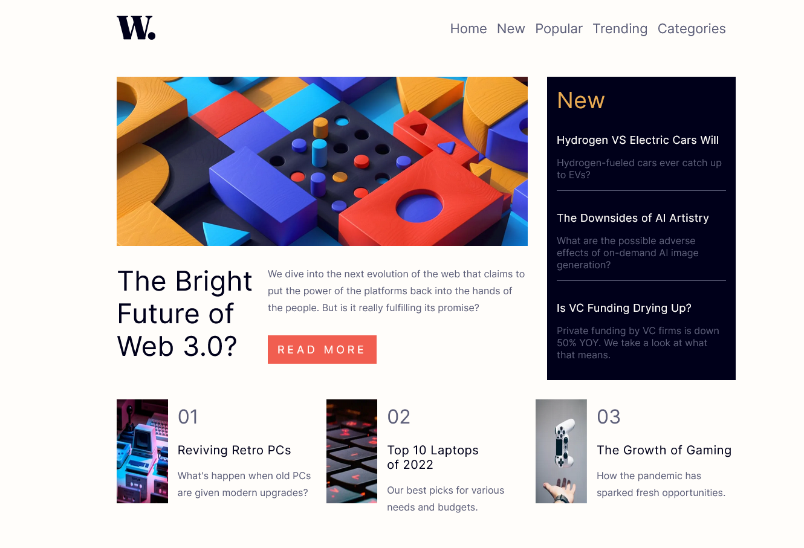

# Frontend Mentor - News homepage solution

This is a solution to the [News homepage challenge on Frontend Mentor](https://www.frontendmentor.io/challenges/news-homepage-H6SWTa1MFl). Frontend Mentor challenges help you improve your coding skills by building realistic projects.

## Table of contents

- [Overview](#overview)
  - [The challenge](#the-challenge)
  - [Screenshot](#screenshot)
  - [Links](#links)
- [My process](#my-process)
  - [Built with](#built-with)
  - [Useful resources](#useful-resources)
- [Author](#author)

## Overview

### The challenge

Users should be able to:

- View the optimal layout for the interface depending on their device's screen size
- See hover and focus states for all interactive elements on the page

### Screenshot

Screenshot-mobile-News-homepage-Frontend-Mentor.png

### Links

- Solution URL: [Source code](https://github.com/belhocineAbdelkader/fem-news-homepage-main)
- Live Site URL: [live site](https://news-homepage-fem-solution.netlify.app/)

## My process

### Built with

- Semantic HTML5 markup
- Sass
- Typescript
- CSS custom properties
- Flexbox
- CSS Grid
- Mobile-first workflow
- including google analytic & sitemap robots

### Useful resources

- [https://utopia.fyi/](https://www.example.com) - Generate clamped fonts depending on screen sizes.

## Author

- Website - [belhocine Abdelkader](https://github.com/belhocineAbdelkader)
- Frontend Mentor - [@belhocineAbdelkader](https://www.frontendmentor.io/profile/belhocineAbdelkader)
- Twitter - [@BelhocineAek](https://twitter.com/BelhocineAek)
- linkedin - [@belhocine-abdelkader](https://www.linkedin.com/in/belhocine-abdelkader-238653263/)
- Facebook - [@belhocine-abdelkader](https://www.linkedin.com/in/belhocine-abdelkader-238653263/)
